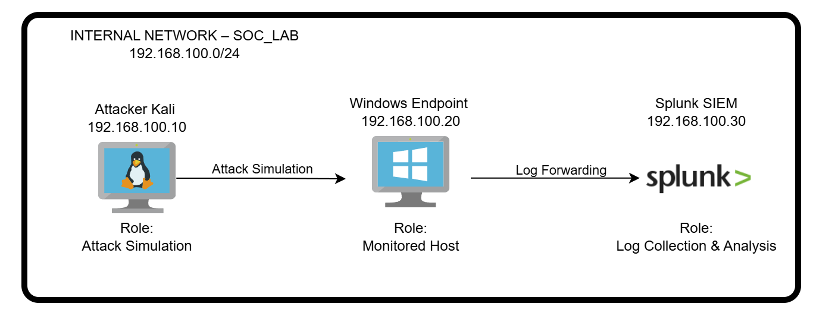
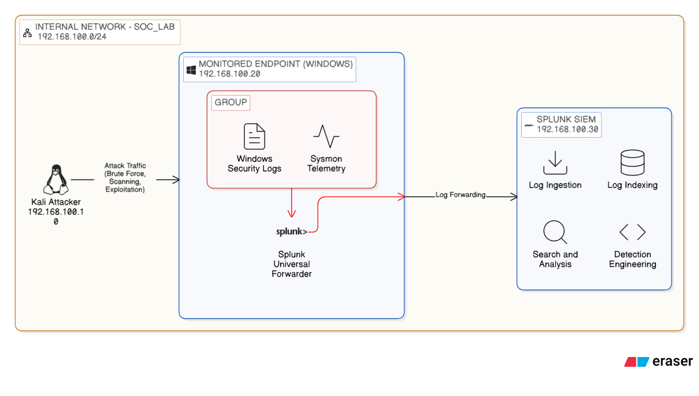

# SOC Home Lab – Architecture Design (Phase 0)
# 🎯 Lab Objective

The objective of this project is to design a controlled Security Operations Center (SOC) home lab environment that simulates real-world attack scenarios and log ingestion workflows.

The lab is structured to emulate a small enterprise security monitoring setup, enabling endpoint telemetry collection, centralised log analysis, and detection engineering practice.

---

# 📌 Lab Scope

This lab environment will include:

- An attacker machine to simulate adversarial activity  
- A monitored endpoint generating security telemetry  
- A SIEM platform for centralised log collection and analysis  
- Network segmentation to isolate attack traffic  
- Defined detection use cases aligned with common SOC scenarios  

The lab is designed for:

- Brute-force detection  
- Suspicious authentication monitoring  
- Network scanning identification  
- Process and command execution visibility  
- Incident investigation workflow practice  

---

# 🧠 Design Principles

The architecture follows these principles:

- **Isolation** – Internal network prevents unintended exposure  
- **Observability** – High-quality logs prioritised (endpoint + authentication)  
- **Detection-first mindset** – Infrastructure built to support detection engineering  
- **Scalability** – Designed to expand into cloud, AI, and identity layers

---

# 🛡 Security Goals

The SOC lab architecture is designed to achieve the following defensive outcomes:

- Centralise security telemetry for improved visibility.
- Detect authentication abuse and brute-force attempts.
- Monitor process execution and privilege escalation activity.
- Identify reconnaissance and suspicious outbound connections.
- Enable structured investigation workflows aligned with Tier 1 SOC operations.

The lab prioritises detection capability and investigation readiness over infrastructure complexity.

---

# 📊 SOC Monitoring Use Cases

The following security-monitoring use cases define the detection objectives for this lab environment. Each use case represents a common Tier 1 SOC scenario and directly influences the required telemetry and architecture design.

| Use Case ID | Scenario | Log Source Required | Detection Goal |
|-------------|----------|--------------------|----------------|
| UC-01 | SSH Brute Force Attempt | Linux auth.log | Detect repeated failed login attempts from a single source |
| UC-02 | RDP Brute Force Attempt | Windows Security Logs | Identify abnormal authentication failures |
| UC-03 | Network Port Scanning | Sysmon Network Logs / Firewall Logs | Detect reconnaissance activity and port enumeration |
| UC-04 | Suspicious Process Execution | Sysmon Process Creation Logs | Monitor unusual command execution or encoded PowerShell |
| UC-05 | Privilege Escalation Attempt | Windows Security Logs / Sysmon | Detect abnormal privilege assignments or elevation |
| UC-06 | Suspicious Outbound Connection | Sysmon Network Logs | Identify potential command-and-control communication |

These use cases are intentionally selected to simulate real-world SOC monitoring responsibilities. The lab architecture and telemetry planning are designed specifically to support the detection and investigation of these scenarios.

---

# 🧰 Tool Selection (Design Rationale)

This lab is designed using commonly adopted SOC tooling and telemetry sources to simulate realistic Tier 1 monitoring workflows.

- **VirtualBox** provides an isolated, repeatable environment suitable for controlled attack simulation.
- **Kali Linux** is used to generate adversarial activity such as brute-force attempts and reconnaissance scans.
- **Windows Endpoint + Sysmon** provides high-fidelity endpoint telemetry (process execution and network connections).
- **Splunk Enterprise** is selected as the SIEM platform to support log ingestion, correlation, alerting, and future detection engineering.

---

# 🏗 High-Level Architecture Overview

This lab is built around three core components:

- **Attacker VM (Kali Linux)** generates controlled malicious activity
- **Endpoint VM (Windows / Linux)** produces authentication + endpoint telemetry
- **SIEM VM (Splunk)** centralises logs for analysis and detection development

An architecture diagram and network design diagram are included in the `diagrams/` directory:

- ## Network Design Diagram

  
- ## SOC Architecture Diagram

  

---

# ✅ Design Assumptions

- The lab is operated in a **single-host home environment** with limited resources.
- All virtual machines are placed in an **isolated internal network** to reduce risk.
- Telemetry design prioritises deep endpoint visibility (authentication + process + network telemetry) over infrastructure complexity.

---

# ⚠️ Limitations (Phase 0)

- This phase documents architecture only. SIEM installation, log onboarding, dashboards, and detections are implemented in Phase 1.
- Network IDS, firewall telemetry, and cloud log sources are planned add-ons and may be introduced in later phases.

---

# 📁 Detailed Planning Documents

Detailed design documents are stored under `planning/`:

- `planning/vm_specifications.md`
- `planning/network_design.md`
- `planning/log_sources.md`
- `planning/threat_simulation_plan.md`

